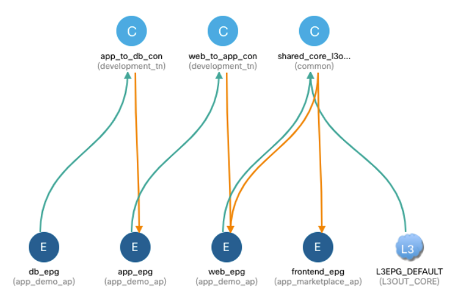
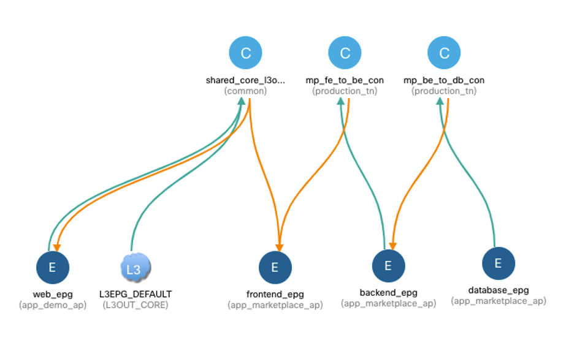
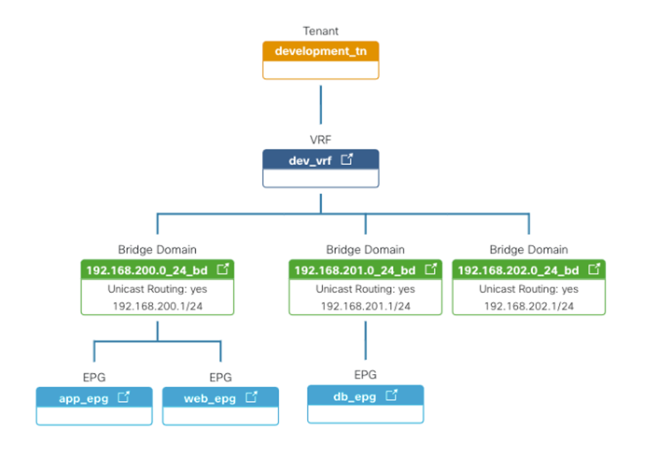
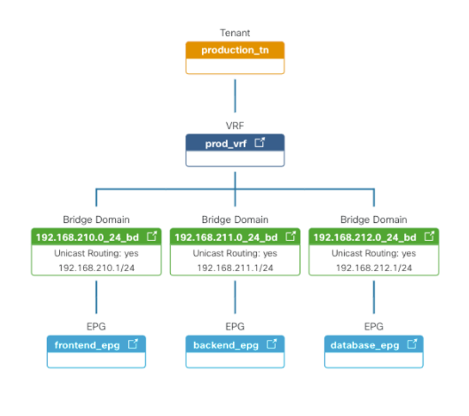

## Summary

This demo creates a development and production environment in Cisco ACI using ansible, where Dev environment is created first and then Prod environment is added using change management workflow in NAE:

* Change is verified before being applied, using NAE Pre-Change Validation (PCV). PCV is created in NAE using ansible as well.
* Some faults are pre-introduced in the demo to be reported in NAE
* After fixing those changes in the playbook, the change can be commited to ACI.
* After the change is made, Delta analysis can be run to verify if the change has been successful.

## Scenario

This demo contains all the required configuration for Development tenant and production tenant. Some configuration is needed beforehand in common:

* A Shared L3Out properly configured, called L3OUT_CORE (name can be modified in playbooks if needed)
* At least one External EPG under the L3Out providing contract called shared_core_l3out_con
* Optionally, a BD using subnet 192.168.210.1/24 in the same VRF as the shared L3OUT, to demonstrate PCV overlapping subnet detection when doing VRF leaking

### Resulting configuration

This is the configuration that will be deployed after running both playbooks without modifications:









## Instructions

* Adapt inventory.yaml to your environment

The playbooks are prepared to run with both ceritificate-based authentication and password-based authentication for APIC.

* Run Development playbooks

```
$ ansible-playbook --vault-pass-file vault.key -i inventory.yaml dev_tenant.yaml dev_app1.yaml
```

* Run Production playbooks with `check` flag

```
$ ansible-playbook --vault-pass-file vault.key -i inventory.yaml prod_tenant.yaml prod_app_marketplace.yaml --check
```

* Run Pre-Change Validation in NAE

```
$ ansible-playbook --vault-pass-file vault.key -i inventory.yaml nae_run_prechange_validation.yaml
```
* When issues are fixed, run Production playbooks without `check` flag

```
$ ansible-playbook --vault-pass-file vault.key -i inventory.yaml prod_tenant.yaml prod_app_marketplace.yaml
```